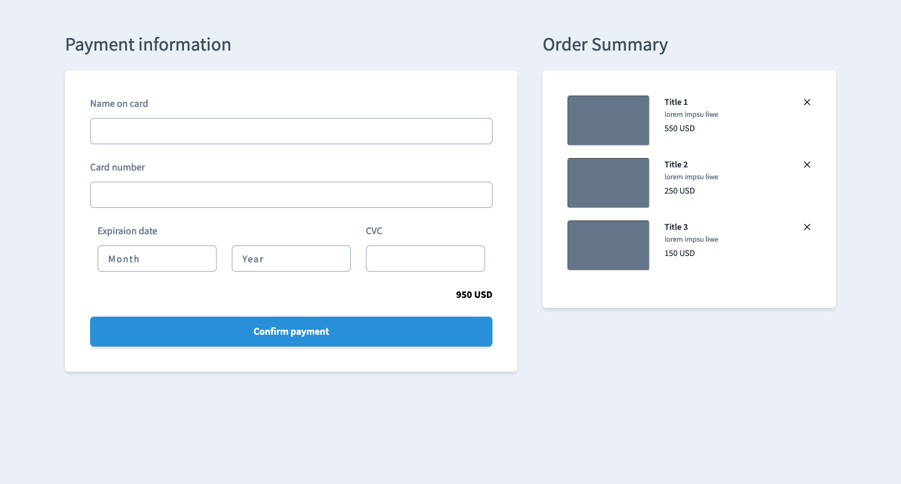

# tailwind-vue-checkout-form

[<h3>Live Demo</h3>](https://vue-checkout-3eaed.web.app/)


or:



## Project setup

```
npm install
```

### Compiles and hot-reloads for development

```
npm run serve
```

### Compiles and minifies for production

```
npm run build
```

### Lints and fixes files

```
npm run lint
```

### Customize configuration

See [Configuration Reference](https://cli.vuejs.org/config/).
